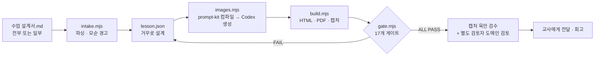
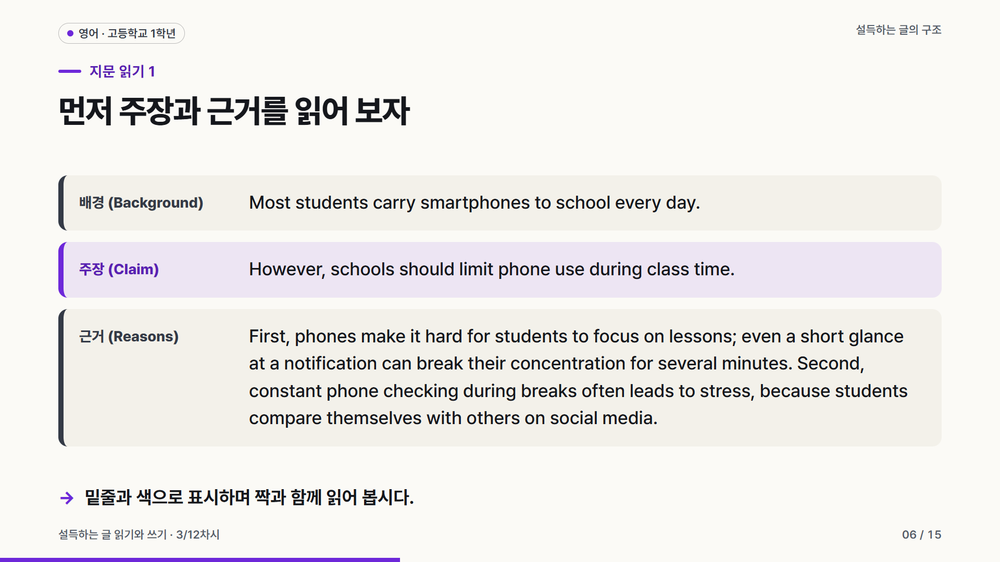

<div align="center">

# classforge

**수업 설계서 한 장으로, 교실에서 바로 쓰는 수업 자료 한 벌.**

Claude Code 스킬 — 수업 슬라이드 · 학생 활동지 · 정답지 · 교수·학습 과정안을 함께 만들고,<br>
17개 자동 품질 게이트와 캡처 육안 검수, 별도 검토자의 도메인 정확성 검토를 통과시킵니다.


<sub>위 슬라이드는 교사가 일부만 채운 설계서(<code>examples/e2e-photoelectric/수업설계서.md</code>)를 스킬을 처음 본 에이전트가 받아 만든 결과입니다.</sub>

</div>

---

## 무엇을 만드나요

| 산출물 | 파일 | 특징 |
|---|---|---|
| 수업 슬라이드 | `out/slides.html` · `slides.pdf` | 밝은 교실 프로젝터용 16:9. 글꼴을 파일 안에 넣어 인터넷 없이 어느 PC에서나 같게 보임. →/Space 넘김, 단계 공개, 퀴즈 정답 공개, 활동 타이머(T), 발표자 노트(N) |
| 학생 활동지 | `out/worksheet.pdf` | A4 자동 쪽 나눔. 정답 글자가 파일에 아예 들어가지 않음 |
| 정답지 | `out/answer-key.pdf` | 같은 배치에 정답 · 풀이 · 정답 그래프 |
| 교수·학습 과정안 | `out/lesson-plan.pdf` | 도입 · 전개 · 정리, 평가 계획(상·중·하), 예상 질문, 다음 차시로 넘어가는 기준 |

<table>
<tr>
<td></td>
<td></td>
</tr>
<tr>
<td></td>
<td></td>
</tr>
<tr>
<td></td>
<td></td>
</tr>
</table>

## 흐름



## 핵심 기능

### 1. 수업 설계서 — 채운 만큼 그대로
[`templates/수업설계서.md`](templates/수업설계서.md)를 교사가 필요한 칸만 채웁니다. 비운 칸은 AI가 수업 설계 규칙으로 정하고, 채운 칸은 게이트 **S7**이 결과물(학생이 보는 화면·활동지)에 실제로 반영됐는지 대조합니다. ★ 표시 4칸(성취기준 · 학습 목표 · 예상 오개념 · 반드시 넣을 것)은 채우면 결과가 가장 크게 좋아집니다. 성취기준을 비우면 AI가 지어내지 않고 `(교사 입력 필요)`로 남깁니다.

```bash
node scripts/intake.mjs 수업설계서.md                    # 채운 항목 / AI가 정할 항목, 모순 경고
node scripts/intake.mjs --check 수업설계서.md lesson.json # 반영 검사 (자동 확인 / 사람 확인 분리)
```

### 2. 증거 중심 스타일 (`meta.profile: "evidence"`)
한 고교 물리 교사의 실제 수업 자료(사용자 제공)를 분석해 옮긴 스타일입니다. 자료를 베끼지 않고 원칙만 가져왔습니다.
- 공식·주장 바로 옆에 그것을 뒷받침하는 실험·역사를 붙인다
- 대립하는 두 설명은 같은 형식으로 나란히 놓고, **다음 장에서** 실험으로 판정한다(판정 전엔 답을 드러내지 않는다)
- 개념 슬라이드 한 장에 정의 하나, 제목은 개념 이름(명사형)도 허용
- 절제된 디자인: 제목 700 · 본문 500, 흰 챕터 슬라이드, 강조색은 움직이는 대상(광선 등) 하나에만
- 오개념은 "그 시대엔 합리적이었지만 이 실험이 무너뜨렸다"는 역사 서사로

게이트 **E1**이 이 규칙들을 검사합니다(정의 하나, 비교 다음 판정, 공식 옆 근거, 그래프 축 이름, 스포일러 경고).

### 3. 생성 이미지 — Codex CLI 오케스트레이션
표지·도입 장면 같은 사진형 이미지는 [공냥이 프롬프트 킷](https://github.com/gongnyang/gongnyang-prompt-kit)의 포맷 A(Scene · Camera · Lighting · Color grading · Texture/Medium + AR)로 프롬프트를 컴파일·검증한 뒤, **Codex CLI의 내장 이미지 도구**로 생성합니다. 이미지 안에는 글자를 넣지 않고(글자는 HTML이 얹음), 프롬프트 해시로 캐시해 다시 과금하지 않습니다. 게이트 **I1**이 프롬프트 검증·파일·해시를 확인합니다.

```bash
node scripts/images.mjs lesson.json --compile-only   # 프롬프트 컴파일·검증만
node scripts/images.mjs lesson.json                  # 생성 (기본: ChatGPT 구독 경로)
```

| 경로 | 조건 | 과금 | 모델 |
|---|---|---|---|
| subscription (기본) | `codex login` (ChatGPT) | ChatGPT 구독 한도 | 서버가 선택 (내장 도구에는 모델 지정 입력이 없음) |
| api | lesson.json `"images": {"model": "…"}` + `OPENAI_API_KEY` | OpenAI API 사용량 | 지정한 모델 문자열을 그대로 요청 (예: `gpt-image-2.5-sunburst`), 거부되면 다른 모델로 바꾸지 않고 실패 |

### 4. 그래프는 계산해서 그린다
좌표평면·막대그래프는 `{"plot": …}` / `{"bars": …}`로 선언하면 빌드가 가로·세로 같은 눈금, 축 이름, 충돌을 피한 라벨로 그립니다. 활동지 그리기 문항에는 빈 좌표평면을, 정답지에는 정답 그래프를 넣을 수 있습니다.

<table><tr>
<td></td>
<td></td>
<td></td>
</tr></table>

## 품질 게이트 (17개)

| 구분 | 게이트 | 검사 |
|---|---|---|
| 정적 | S1 구조 · S2 글자 수 · S3 목표-평가 연결 · S4 수치 근거 · S5 문체 · S6 성취기준 · S7 설계서 반영 | 필수 유형과 흐름, 학교급별 글자 수, 목표마다 평가 문항, 화면의 모든 수치가 출처 있는 `facts`에 있는지, 설계서 반영 |
| 스타일 | E1 증거 중심 | evidence 프로필 규칙 |
| 이미지 | I1 | 프롬프트 검증, 생성 파일·해시·해상도 |
| 브라우저 실측 | B1 넘침·겹침 · B2 글자 크기·선 관통 · B3 명암 대비 · B4 글꼴 · B5 화면 밀도 · B6 A4 쪽 · B7 정답 분리 · B8 실행 오류 | Playwright로 실제 렌더링을 재어 판정 |

게이트가 못 잡는 것(그림의 과학적 정확성, 어색한 줄바꿈)은 캡처 육안 검수와 **작성자가 아닌 별도 검토자**의 도메인 정확성 검토로 잡습니다.

## 설치 (Claude Code 스킬)

```bash
git clone https://github.com/sehunYang/classforge ~/.claude/skills/classforge
cd ~/.claude/skills/classforge
npm install                 # playwright-core (브라우저는 설치된 Chrome/Edge 사용)
pip install fonttools       # 글꼴 서브셋
```

필요한 것: Node 18+, Python 3, Chrome 또는 Edge(`CLASSFORGE_CHROME`로 경로 지정 가능). 이미지 생성을 쓰려면 Codex CLI(`npm i -g @openai/codex` 후 `codex login`).

Claude Code에서 "중2 수학 일차함수 3차시 수업 자료 만들어 줘" 또는 "이 수업 설계서대로 만들어 줘"라고 요청하면 스킬이 동작합니다. 직접 실행할 수도 있습니다:

```bash
node scripts/build.mjs examples/season/lesson.json
node scripts/gate.mjs  examples/season/lesson.json
```

## 예시

| 폴더 | 수업 | 비고 |
|---|---|---|
| [`examples/season`](examples/season) | 초6 과학 · 계절의 변화 | 기본 예시 |
| [`examples/linear-function`](examples/linear-function) | 중2 수학 · 일차함수의 그래프 | 선언형 그래프 |
| [`examples/territory`](examples/territory) | 초5 사회 · 국토의 위치와 영역 | 경위도로 만든 단순화 지도 |
| [`examples/argument-essay`](examples/argument-essay) | 고1 영어 · 설득하는 글의 구조 | 지문(`passage`) 슬라이드 |
| [`examples/evidence-demo`](examples/evidence-demo) | 고1 물리 · 빛의 굴절과 스넬 법칙 | evidence 프로필, 수식 표기 |
| [`examples/e2e-photoelectric`](examples/e2e-photoelectric) | 고1 물리 · 광전 효과 | 교사 설계서(일부 기입) → 블라인드 생성, Codex 표지 이미지, 도메인 검토 기록 |
| [`examples/intake`](examples/intake) | 설계서 예시 | 일부 기입 · 전체 기입 · 일부러 어긴 예 |

`out/`은 저장소에 없습니다. 위 `build.mjs`로 만드세요.

## 만든 과정

강의 「ChatGPT Astra 업무자동화 사용법」(패스트캠퍼스, 2026-09-22)의 원칙 — 목적을 먼저, 레퍼런스는 구조만 읽기, 게이트는 물리적 브레이크, 작은 부품 조합, 회고 — 을 바탕으로 Claude Code에서 만들었습니다. 구현은 여러 Sonnet 에이전트가 나눠 맡고, 스킬 문서만 본 에이전트가 새 주제로 블라인드 테스트를 하고, 별도 Opus 평가자가 판정(Accept/Reject)하는 루프를 기준을 넘을 때까지 반복했습니다.

## 출처와 라이선스

- 코드: [MIT](LICENSE)
- 설계 참고: 공냥이(gongnyang) 공개 저장소 — deck-factory, awesome-html-scrolline-deck, bookforge, cardprinter, gongnyang-prompt-kit, gongnangi-chart-skill, data-literacy-with-ai (모두 MIT). 코드 복사 없이 구조·원칙만 참고했고, `vendor/prompt-kit/`은 MIT 라이선스와 함께 동봉. 자세히는 [CREDITS.md](CREDITS.md)
- 글꼴: [Pretendard](https://github.com/orioncactus/pretendard) — SIL Open Font License 1.1 (`assets/fonts/LICENSE-Pretendard-OFL.txt`)
- 예시 수업의 내용·삽화는 이 프로젝트에서 새로 만든 것이며, 표지 이미지는 Codex로 생성했습니다. 예시 수업의 성취기준은 원문 확인이 필요하다고 표시되어 있습니다.
