<div align="center">

# classforge

**수업 설계서 한 장으로, 교실에서 바로 쓰는 수업 자료 한 벌.**

Claude Code 스킬 — 수업 슬라이드 · 학생 활동지 · 정답지 · 교수·학습 과정안을 함께 만들고,<br>
20개(+KoPub을 쓰면 21개) 자동 품질 게이트, 별도 검토자의 도메인 정확성 검토(`review.json`), 캡처 육안 검수를 통과시킵니다.

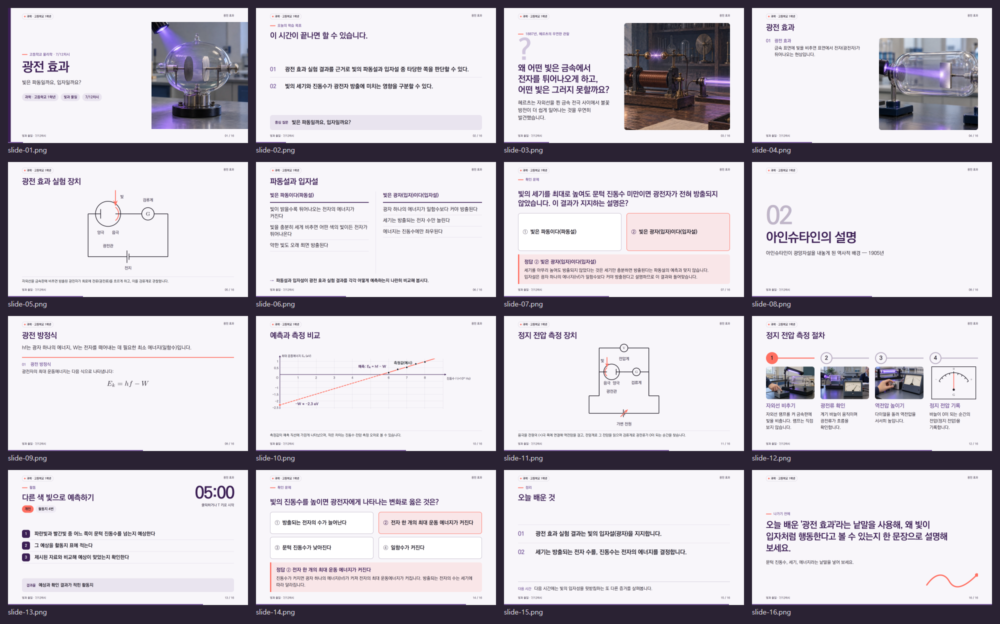

<sub>위 슬라이드는 교사가 일부만 채운 설계서(<code>examples/photoelectric/수업설계서.md</code>)를 스킬을 처음 본 에이전트가 받아 만든 결과입니다. 삽화는 손그림 대신 그래프 엔진과 TikZ로 계산해서 그립니다.</sub>

</div>

---

## 무엇을 만드나요

| 산출물 | 파일 | 특징 |
|---|---|---|
| 수업 슬라이드 | `out/slides.html` · `slides.pdf` | 밝은 교실 프로젝터용 16:9. 모든 교과가 같은 고정 팔레트(짙은 보라 제목, 보라 소제목, 코럴은 배지·밑줄 같은 표시에만). 글꼴을 파일 안에 넣어 인터넷 없이 어느 PC에서나 같게 보임. →/Space 넘김, 단계 공개, 퀴즈 정답 공개, 활동 타이머(T), 발표자 노트(N) |
| 학생 활동지 | `out/worksheet.pdf` | A4 자동 쪽 나눔. 정답 글자가 파일에 아예 들어가지 않음 |
| 정답지 | `out/answer-key.pdf` | 같은 배치에 정답 · 풀이 · 정답 그래프 · 채점 기준 |
| 교수·학습 과정안 | `out/lesson-plan.pdf` | 도입 · 전개 · 정리, 평가 계획(상·중·하), 예상 질문, 다음 차시로 넘어가는 기준 |

<table>
<tr>
<td>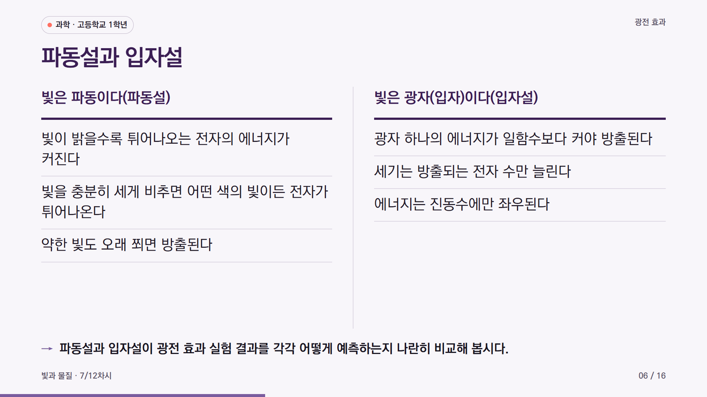</td>
<td>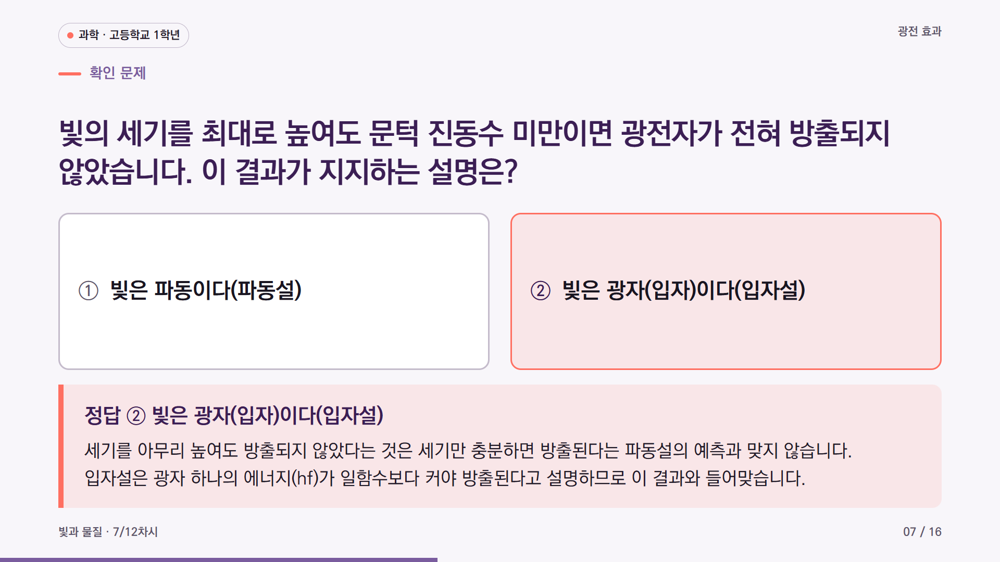</td>
</tr>
<tr>
<td>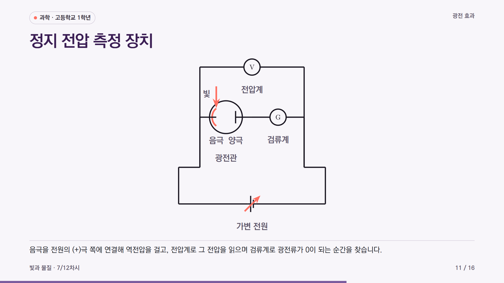</td>
<td>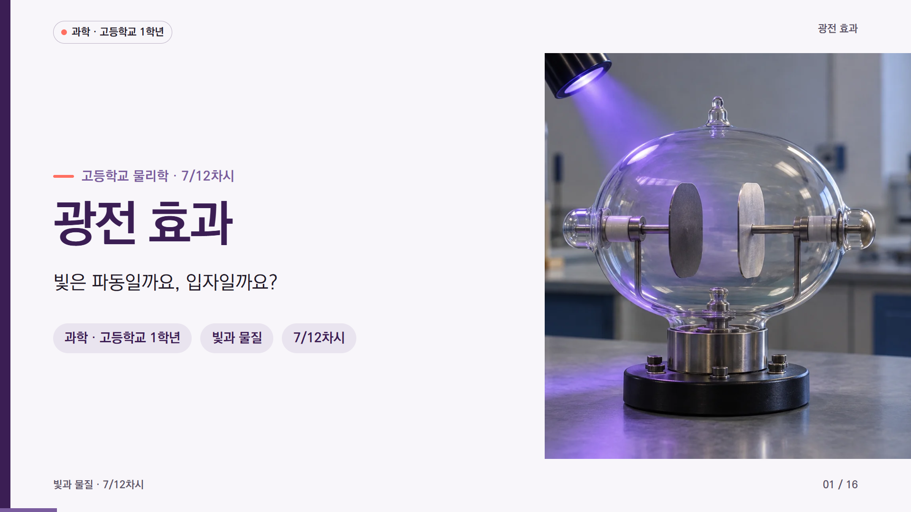</td>
</tr>
<tr>
<td>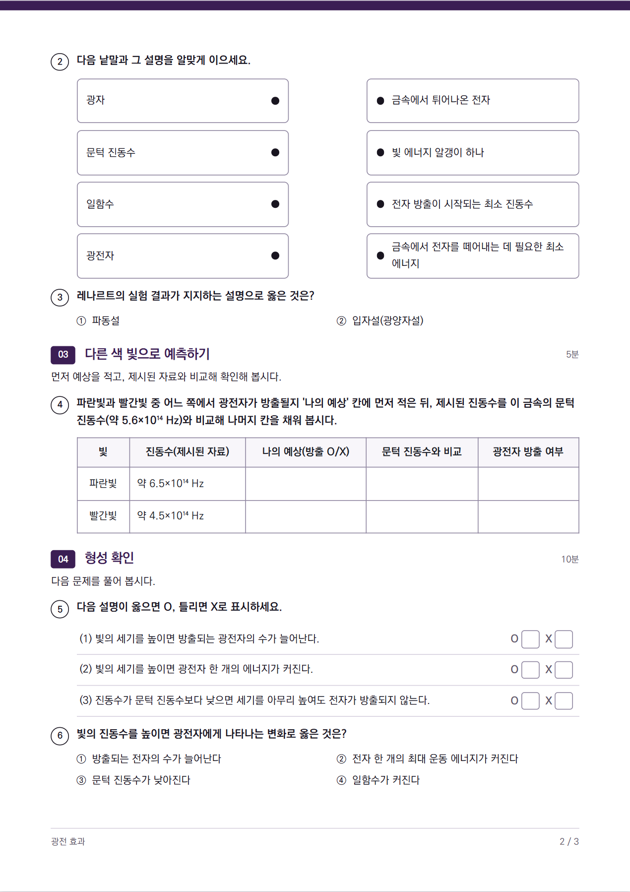</td>
<td>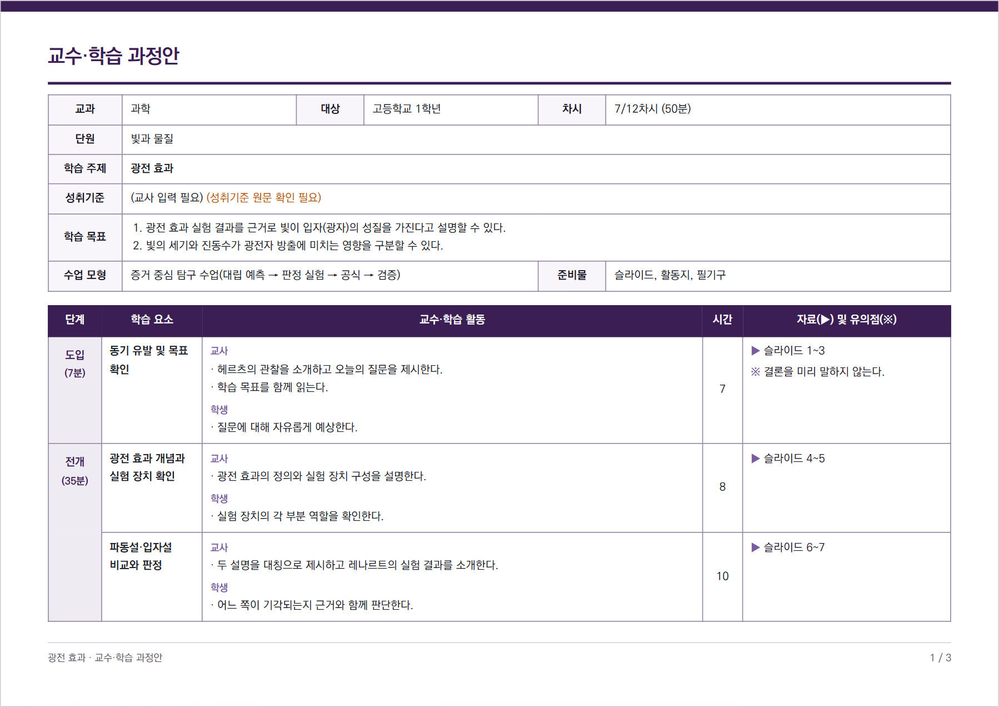</td>
</tr>
</table>

<table>
<tr>
<td>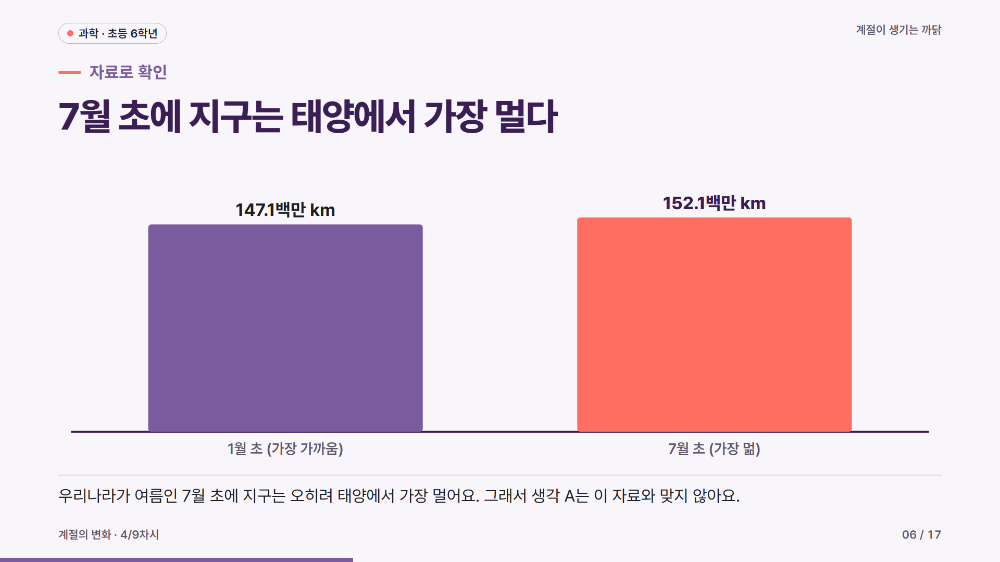</td>
<td>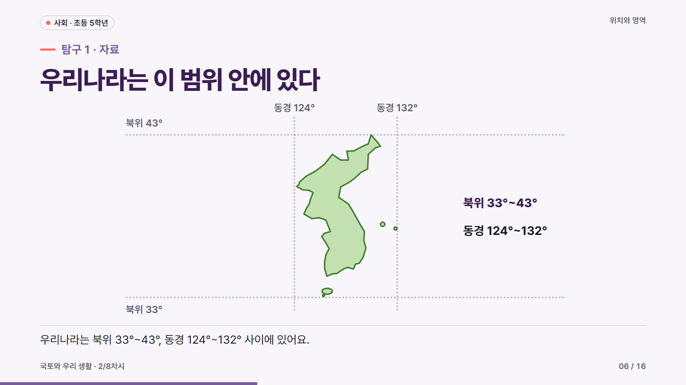</td>
</tr>
<tr>
<td>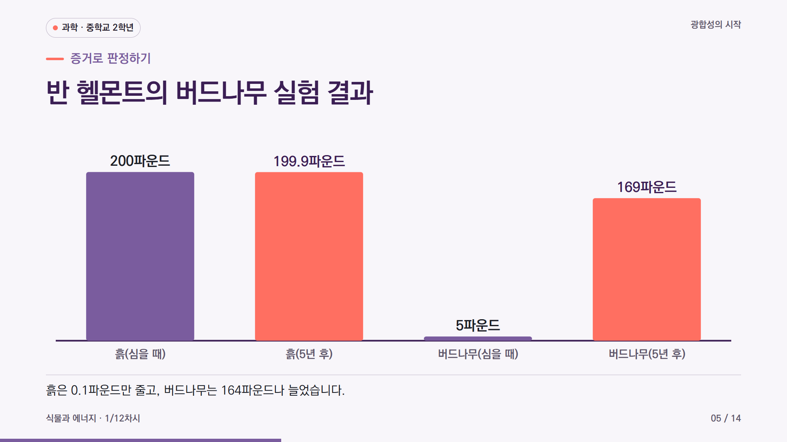</td>
<td>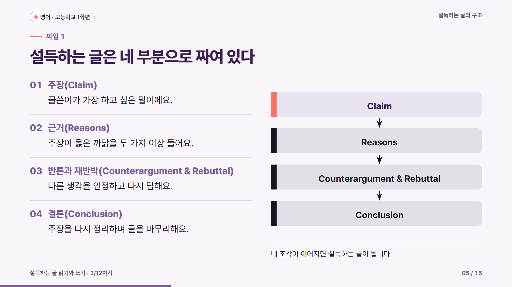</td>
</tr>
</table>

## 흐름

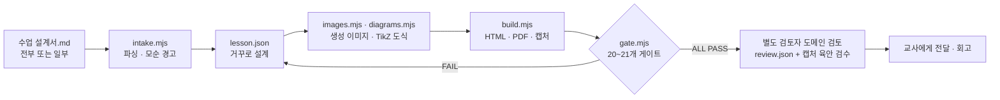

## 핵심 기능

### 1. 수업 설계서 — 채운 만큼 그대로
[`templates/수업설계서.md`](templates/수업설계서.md)를 교사가 필요한 칸만 채웁니다. 비운 칸은 AI가 수업 설계 규칙으로 정하고, 채운 칸은 게이트 **S7**이 결과물(학생이 보는 화면·활동지)에 실제로 반영됐는지 대조합니다. ★ 표시 4칸(성취기준 · 학습 목표 · 예상 오개념 · 반드시 넣을 것)은 채우면 결과가 가장 크게 좋아집니다. 성취기준을 비우면 AI가 지어내지 않고 `(교사 입력 필요)`로 남깁니다.

```bash
node scripts/intake.mjs 수업설계서.md                    # 채운 항목 / AI가 정할 항목, 모순 경고
node scripts/intake.mjs --check 수업설계서.md lesson.json # 반영 검사 (자동 확인 / 사람 확인 분리)
```

### 2. 삽화는 손으로 그리지 않는다 — 세 갈래 규칙
게이트 **V1**이 강제합니다. lesson.json에 손으로 쓴 `<svg>` 문자열은 어디에도 허용되지 않습니다(V1-RAWSVG).
- **좌표평면·함수 그래프·막대그래프** → `{plot}`/`{bars}` 선언형 — 빌드가 눈금·축·라벨을 계산해서 그립니다.
- **정확한 각도·좌표·기호가 필요한 정밀 도형**(광선 추적, 회로, 입자 모형, 작도, 지도·구조도) → **TikZ 도해 엔진** `{tikz}`/`{refraction}`/`{circuit}`/`{particles}`/`{geometry}`/`{vectors}`. `scripts/diagrams.mjs`가 이 PC에 **MiKTeX**나 **TeX Live**(둘 다 선택 설치, 있으면 우선 사용)가 있으면 `latex`+`dvisvgm`으로, 없으면 **node-tikzjax**(오프라인 WASM TeX, npm 설치 시 자동으로 딸려 옴)로 대체 컴파일해 `<lesson>/diagrams/`에 SVG로 캐시합니다 — 교사 PC에 아무것도 설치돼 있지 않아도 항상 동작합니다. 회로는 `checkCircuitConnectivity`로 배선이 실제로 이어졌는지, 극성이 문서와 맞는지 빌드 시점에 검증합니다.
- **정확한 값이 필요 없는 사진형 삽화**(표지·도입 장면·실물 사진) → `{image:{...}}` 생성 이미지(아래).

<table><tr>
<td></td>
<td></td>
<td></td>
</tr></table>

### 3. 생성 이미지 — Codex CLI 구독 경로
사진형 이미지는 [공냥이 프롬프트 킷](https://github.com/gongnyang/gongnyang-prompt-kit)의 포맷 A(Scene · Camera · Lighting · Color grading · Texture/Medium + AR)로 프롬프트를 컴파일·검증한 뒤, **Codex CLI의 내장 이미지 도구**(`codex exec`, 사용자의 ChatGPT 구독 쿼터)로 생성합니다. API 키 경로는 없습니다 — 항상 구독 경로만 쓰고, 개수 제한도 없습니다(수업에 필요하면 몇 장이든 만듭니다). 이미지 안에는 글자를 넣지 않고(글자는 HTML이 얹음), 프롬프트 해시로 캐시해 다시 과금하지 않습니다. 게이트 **I1**이 프롬프트 검증·파일·해시·해상도를 확인하고, 서로 다른 두 이미지가 완전히 같은 파일이면(동시 생성 사고) FAIL(I1-DUPHASH)로 잡습니다.

```bash
node scripts/images.mjs lesson.json --compile-only   # 프롬프트 컴파일·검증만
node scripts/images.mjs lesson.json                  # 생성 (구독 경로, 이미지당 약 1분)
node scripts/images.mjs lesson.json --prune           # lesson.json이 더는 안 쓰는 캐시 이미지 정리
```

### 4. 증거 중심 스타일 (`meta.profile: "evidence"`)
한 고교 물리 교사의 실제 수업 자료(사용자 제공)를 분석해 옮긴 스타일입니다. 자료를 베끼지 않고 원칙만 가져왔습니다.
- 공식·주장 바로 옆에 그것을 뒷받침하는 실험·역사를 붙인다
- 대립하는 두 설명은 같은 형식으로 나란히 놓고, **다음 장에서** 실험·자료로 판정한다(판정 전엔 답을 드러내지 않는다 — 학습 목표·판정 앞 서술까지 같은 기준으로 검사한다)
- 개념 슬라이드 한 장에 정의 하나, 제목은 개념 이름(명사형)도 허용
- 근거는 공식을 그린 그래프가 아니라 **"예측 vs 측정"**이어야 한다: 실측값(`data`)을 오차와 함께 예측선과 나란히 그리고, 지어낸 값이면 그래프 라벨에도 "(예시)"라고 밝힌다
- 판정은 근거가 있어야 하고 **구별력**이 있어야 한다: `evidence:{fact, refutes}`로 어느 설명을 왜 반박하는지 밝히고, "반대쪽 설명도 이 관찰을 예측하는가?"를 스스로 물어 양쪽 다 설명되는 근거를 거른다
- 오개념을 다룰 때는 연도·인물이 있는 진짜 역사적 사실을 인용한다(못 찾으면 지어내지 않고 표시한다)
- 산물·효과를 확인하는 실험은 **대조 조건**과 함께 보여준다

게이트 **E1**이 이 규칙들을 검사합니다(정의 하나, 비교 다음 판정과 그 근거·구별력, 예측 vs 측정 데이터 검증, 오개념의 역사 인용, 스포일러·사전 유출 경고, 회로·장치는 반드시 도해 엔진으로).

### 5. 그래프는 계산해서 그린다
좌표평면·막대그래프는 `{"plot": …}` / `{"bars": …}`로 선언하면 빌드가 축 이름, 충돌을 피한 라벨로 그립니다. 수식 그래프(직선·곡선만 있는 경우)는 가로·세로 같은 눈금을 쓰고, 측정 자료(`data`)가 있는 그래프는 두 축을 독립적으로 맞춰 값이 잘 보이게 그립니다. 활동지 그리기 문항에는 빈 좌표평면을, 정답지에는 정답 그래프를 넣을 수 있습니다.

<table><tr>
<td>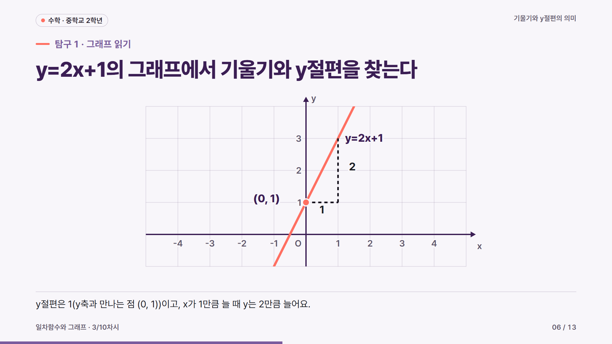</td>
</tr></table>

### 6. 안전 — 실험 절차의 흔한 함정을 코드로 막는다
게이트 **S8**이 교과별 실험 절차의 흔한 사고를 표(`TRAP_ROWS`)로 잡습니다: 에탄올 가열은 반드시 물중탕+화기 주의, 아이오딘 반응은 탈녹말(하루 이상 어둠)과 에탄올 탈색 언급 없이는 FAIL, 향불로 기체를 확인하면 기체를 모으는 절차(또는 교사 시범·미리 모은 기체 명시)가 있어야 합니다. 표에 행만 추가하면 새 함정을 계속 검사할 수 있습니다.

### 7. 도메인 검토 기록 — `review.json` (게이트 R1)
게이트가 못 잡는 것(삽화의 과학적 정확성, 그림과 캡션의 불일치, 회로 극성)은 **작성자가 아닌 별도 검토자**가 SKILL.md 7.2의 체크리스트대로 슬라이드·활동지·정답지를 모두 보고 `review.json`에 슬라이드·이미지·실험 단위 판정("맞음"/"애매"/"틀림")을 남깁니다. 게이트 **R1**은 review.json이 있는지, 그 안에 미해결 "틀림"이 없는지, 그리고 **검토 시점의 lesson.json·이미지 내용 해시(`stamp`)와 지금 내용이 같은지**만 확인합니다(수정 시각이 아니라 내용 해시로 신선함을 판정합니다). 검토를 마친 뒤 아래 명령으로 도장을 찍습니다.

```bash
node scripts/gate.mjs lesson.json --review-stamp   # review.json에 stamp{lesson, images} 기록
```

## 품질 게이트 (20개, +KoPub을 쓰면 B9, 21개)

| 구분 | 게이트 | 검사 |
|---|---|---|
| 정적 | S1 구조(+필드 모양 S1-SHAPE) · S2 글자 수 · S3 목표-평가 연결 · S4 수치 근거 · S5 문체(+문체 통일 S5-TONE) · S6 성취기준 · S7 설계서 반영 · S8 안전(교과별 실험 함정) | 필수 유형과 흐름, 학교급별 글자 수, 목표마다 평가 문항, 화면의 모든 수치가 출처 있는 `facts`에 있는지, 설계서 반영, 실험 절차의 안전·함정 문구 |
| 스타일 | E1 증거 중심(데이터 검증·판정 근거/구별력·역사 인용·스포일러·회로는 도해 엔진으로) | evidence 프로필 규칙 |
| 이미지 | I1(프롬프트·캐시·해상도·중복 파일 I1-DUPHASH) | `node scripts/images.mjs` |
| 시각 정책 | V1(손그림 SVG 금지, 그래프/도해/이미지 세 갈래 강제, 판정 슬라이드에 이미지로 값 대체 금지) | `node scripts/diagrams.mjs`/`images.mjs` |
| 도메인 검토 | R1(review.json 존재·미해결 문제·내용 해시 신선도) | `references/review-schema.md` |
| 브라우저 실측 | B1 넘침·겹침 · B2 글자 크기·선(+가림 B2-OCCLUDE·겹친 라벨 B2-TEXTOVERLAP) · B3 명암 대비 · B4 글꼴 · B5 화면 밀도 · B6 A4 쪽 · B7 정답 분리 · B8 실행 오류 · B9 KoPub 미설치 대체 배치(KoPub 쓸 때만) | Playwright로 실제 렌더링을 재어 판정 |

게이트가 못 잡는 것(그림의 과학적 정확성, 어색한 줄바꿈)은 캡처 육안 검수와 **작성자가 아닌 별도 검토자**의 도메인 정확성 검토(`review.json`)로 잡습니다.

## 설치 (Claude Code 스킬)

```bash
git clone https://github.com/sehunYang/classforge ~/.claude/skills/classforge
cd ~/.claude/skills/classforge
npm install                 # playwright-core, node-tikzjax(TikZ 대체 엔진)
pip install fonttools       # 글꼴 서브셋
```

필요한 것: Node 18+, Python 3, Chrome 또는 Edge(`CLASSFORGE_CHROME`로 경로 지정 가능). 정밀 도식(회로·광학·기하)에는 **MiKTeX**나 **TeX Live**를 설치해 두면 더 정확한 렌더링(시스템 LaTeX+dvisvgm)을 쓰고, 없어도 `npm install`이 받은 node-tikzjax가 자동으로 대신합니다 — 둘 다 선택 사항입니다. 이미지 생성을 쓰려면 Codex CLI(`npm i -g @openai/codex` 후 `codex login`).

Claude Code에서 "중2 수학 일차함수 3차시 수업 자료 만들어 줘" 또는 "이 수업 설계서대로 만들어 줘"라고 요청하면 스킬이 동작합니다. 직접 실행할 수도 있습니다:

```bash
node scripts/build.mjs examples/season/lesson.json
node scripts/gate.mjs  examples/season/lesson.json
```

## 예시

| 폴더 | 수업 | 비고 |
|---|---|---|
| [`examples/season`](examples/season) | 초6 과학 · 계절의 변화 | 기본 예시(SKILL.md가 가리키는 모델 레슨). 지구-태양 거리 자료로 오개념을 반박하는 판정, TikZ 각도·궤도 도해, 사진+TikZ 혼합 절차 |
| [`examples/photoelectric`](examples/photoelectric) | 고1 물리 · 광전 효과 | evidence 프로필 · KoPub. 교사 설계서(일부 기입) → 생성, Codex 표지·절차 사진, TikZ/circuitikz 정지 전압 측정 회로(V1-APPARATUS-INSTRUMENT), 도메인 검토 기록 |
| [`examples/photosynthesis`](examples/photosynthesis) | 중2 과학 · 광합성 | evidence 프로필 · KoPub. 반 헬몬트 실험(출처 있는 역사), 교사 시범으로 처리한 향불 확인(S8-TRAP) |
| [`examples/territory`](examples/territory) | 초5 사회 · 국토의 위치와 영역 | TikZ 좌표로 그린 단순화 지도(`mapgen.mjs`), 무해통항·기준선 등 법률 정확성 검토 |
| [`examples/argument-essay`](examples/argument-essay) | 고1 영어 · 설득하는 글의 구조 | 지문(`passage`) 슬라이드, TikZ 박스+화살표 구조도 |
| [`examples/linear-function`](examples/linear-function) | 중2 수학 · 일차함수의 그래프 | 선언형 그래프(`{plot}`) |
| [`examples/intake`](examples/intake) | 설계서 예시 | 일부 기입 · 전체 기입 · 일부러 어긴 예 |

모든 예시는 `review.json`(별도 검토자의 도메인 검토 기록 + `--review-stamp`)을 포함해 게이트 **ALL PASS**입니다. `out/`은 저장소에 없습니다. 위 `build.mjs`로 만드세요.

## 만든 과정

강의 「ChatGPT Astra 업무자동화 사용법」(패스트캠퍼스, 2026-09-22)의 원칙 — 목적을 먼저, 레퍼런스는 구조만 읽기, 게이트는 물리적 브레이크, 작은 부품 조합, 회고 — 을 바탕으로 Claude Code에서 만들었습니다. 구현은 여러 Sonnet 에이전트가 나눠 맡고, 스킬 문서만 본 에이전트가 새 주제로 블라인드 테스트를 하고, 별도 Opus 평가자가 판정(Accept/Reject)하는 루프를 기준을 넘을 때까지 반복했습니다. 손그림 SVG를 걷어내고 TikZ 도해 엔진과 `review.json` 도메인 검토 기록을 도입한 뒤 8라운드 만에 ACCEPT를 받았습니다.

## 출처와 라이선스

- 코드: [MIT](LICENSE)
- 설계 참고: 공냥이(gongnyang) 공개 저장소 — deck-factory, awesome-html-scrolline-deck, bookforge, cardprinter, gongnyang-prompt-kit, gongnangi-chart-skill, data-literacy-with-ai (모두 MIT). 코드 복사 없이 구조·원칙만 참고했고, `vendor/prompt-kit/`은 MIT 라이선스와 함께 동봉. 정밀 도식은 시스템 **MiKTeX**/**TeX Live**(선택 설치, 동봉하지 않음, `latex`+`dvisvgm` 외부 호출) 또는 **node-tikzjax**(LPPL-1.3c, circuitikz 포함)로 렌더링합니다. 자세히는 [CREDITS.md](CREDITS.md)
- 글꼴: [Pretendard](https://github.com/orioncactus/pretendard) — SIL Open Font License 1.1 (`assets/fonts/LICENSE-Pretendard-OFL.txt`), 임베딩됨. **KoPub World 글꼴은 포함·재배포하지 않습니다** — 등록 후 무료지만 가공·재배포가 금지돼 있어, 교사 PC에 이미 설치돼 있으면 CSS `local()`로 참조만 하고 없으면 자동으로 Pretendard로 대체됩니다(게이트 B9가 대체 배치를 확인). `meta.font`: `auto`(기본, evidence 프로필에서 KoPub 시도)/`kopub`/`pretendard`.
- 예시 수업의 내용·삽화는 이 프로젝트에서 새로 만든 것이며, 사진형 이미지는 Codex로 생성했습니다. 예시 수업의 성취기준은 원문 확인이 필요하다고 표시되어 있습니다.
